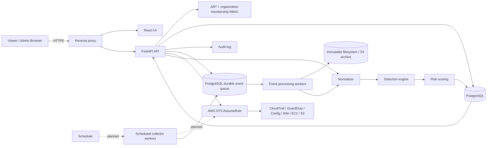

# Architecture

## Database architecture

`users` are global identities. `organizations` and `organization_memberships` define customer workspaces and workspace-specific roles. `cloud_accounts`, `assets`, `findings`, `alerts`, `incidents`, and `audit_logs` carry a required organization ID. Every application transaction sets `app.current_organization_id`; forced PostgreSQL row-level-security policies use that setting for both row visibility and write validation. Tenant-owned natural identifiers use organization-scoped uniqueness, while composite foreign keys prevent cross-organization asset relationships. Alembic owns schema evolution and backfills legacy records into the default organization.

Application connections may immediately `SET ROLE cloud_security_runtime`, a non-login, non-owner role without `BYPASSRLS`. Migrations use the database owner through `MIGRATION_DATABASE_URL` when a separate URL is available. Production startup fails when `RLS_ENFORCEMENT_REQUIRED=true` and any tenant table lacks forced RLS or the effective application role can bypass it.

Production ingestion stores raw and normalized events in PostgreSQL and archives a canonical envelope before detection. Organization-specific JSONL paths remain only as a transitional local/test store.

## Durable ingestion architecture

CloudTrail API and collector inputs are normalized and inserted into the tenant-owned `security_events` table before processing. The organization-scoped event ID is the idempotency key. Independent workers claim available records with PostgreSQL `FOR UPDATE SKIP LOCKED`, so multiple worker replicas can process without duplicate leases. Each lease records its worker and timestamp; expired leases return to the retry queue. Failures use exponential backoff and become `dead_letter` after the configured attempt limit. Administrators and analysts can replay a dead-letter record through the API.

Detection outputs remain idempotent through tenant-scoped alert and incident identifiers. This permits safe event retries if a worker exits after creating a detection but before marking the event complete. JSONL storage remains available only for legacy/local pipeline tests and is no longer the production API ingestion path.

The archive is content-addressed by SHA-256. Compose uses a dedicated append-only filesystem volume; S3 production archives use conditional creation, checksum verification, server-side encryption and compliance-mode Object Lock. PostgreSQL retention removes only completed rows with confirmed archive metadata. Dead letters are never removed by the completed-event cleanup policy.

## Authentication architecture

The API validates salted PBKDF2 password hashes and applies configurable failed-login lockout. A successful login creates a server-side `auth_sessions` record. The browser keeps a ten-minute signed access token only in memory and receives a rotating refresh token in a `Secure`, `HttpOnly`, `SameSite=Strict` cookie. Only refresh-token hashes are stored. Rotation is serialized with a database row lock, and reuse of the previous token revokes the session. Logout, user deactivation, membership deactivation, expiry, and the Settings session controls all invalidate server-side sessions immediately.

Access tokens identify one organization membership and one revocable session. Middleware reloads the active session, user, organization, membership, and role from PostgreSQL on every request. Organization switching changes the session context and makes the previous organization-bound access token invalid. Explicit `require_roles("admin")` dependencies protect cloud-account and direct AWS operations. Bootstrap credentials create the first administrator only and never reset an existing account.

TOTP MFA seeds are protected with AES-GCM and per-user associated data. MFA challenges are short-lived, server-side, row-locked and single-use; TOTP time steps cannot be replayed. Recovery codes are high-entropy, stored only as keyed hashes, and atomically marked used. Enabling or disabling MFA revokes every other active session. PostgreSQL-backed IP and principal counters provide a shared authentication rate limit across API replicas without storing raw usernames or addresses in the rate-limit keys.

Optional OIDC uses authorization code flow with PKCE, signed state, nonce validation, exact issuer/audience validation, JWKS signature validation and an explicit signing-algorithm allowlist. Automatic provisioning is off. Identities must be pre-linked, or an operator must explicitly permit verified-email linking and allowed domains. A SAML bridge can be supplied by the enterprise identity provider through OIDC; native SAML and WebAuthn/passkeys remain future extensions.

## AWS access architecture

The platform stores an AWS account ID, region, monitoring role ARN, and optional external ID. Collection loads the cloud account within the authenticated organization, calls `sts:AssumeRole`, keeps the returned temporary credentials in memory, and verifies that `sts:GetCallerIdentity` matches the selected AWS account before calling EC2. Long-lived customer access keys are not part of onboarding.

`app.secrets.SecretProvider` defines the deployment boundary for environment,
AWS Secrets Manager, Vault, or Kubernetes-backed implementations. The included
environment provider is intended for development and container-injected secrets.

## API groups

- `/api/v1/auth`: password/MFA/OIDC login, refresh, logout, MFA lifecycle, organization switching and active-session revocation
- `/api/v1/cloud-accounts`: safe listing plus admin create/update/delete/test
- `/api/v1/aws`: admin-only direct AWS validation and collection
- `/api/v1/dashboard`, `/statistics`: posture and metrics
- `/api/v1/events`, `/assets`, `/findings`: investigation data
- `/api/v1/events/queue`: tenant queue health and dead-letter replay
- `/api/v1/alerts`, `/incidents`: operational lifecycle
- `/api/v1/users`: administrator-only identity management
- `/api/v1/health` and `/metrics`: runtime health and observability
