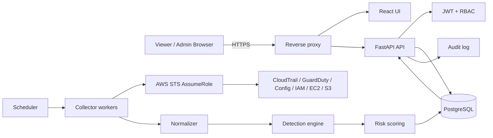

# Architecture

## Database architecture

`users` and `audit_logs` implement identity and accountability. `cloud_accounts` stores safe account metadata, role ARN, write-only external ID, monitoring state, services, and health. `assets`, `findings`, `alerts`, `incidents`, and normalized CloudTrail records carry account context. Alembic owns schema evolution.

## Authentication architecture

The API issues expiring signed bearer tokens after validating a salted PBKDF2 password hash. Middleware validates active users on protected requests. Explicit `require_roles("admin")` dependencies protect cloud-account and direct AWS operations. A production evolution should use Secure HttpOnly cookies, CSRF protection, MFA, and an external identity provider.

## AWS access architecture

The platform stores an AWS account ID, region, monitoring role ARN, and optional external ID. It calls `sts:AssumeRole`, uses the returned temporary session credentials in memory, and verifies the account through `sts:GetCallerIdentity`. Long-lived customer access keys are not part of onboarding.

`app.secrets.SecretProvider` defines the deployment boundary for environment,
AWS Secrets Manager, Vault, or Kubernetes-backed implementations. The included
environment provider is intended for development and container-injected secrets.

## API groups

- `/api/v1/auth`: login, status, current user
- `/api/v1/cloud-accounts`: safe listing plus admin create/update/delete/test
- `/api/v1/aws`: admin-only direct AWS validation and collection
- `/api/v1/dashboard`, `/statistics`: posture and metrics
- `/api/v1/events`, `/assets`, `/findings`: investigation data
- `/api/v1/alerts`, `/incidents`: operational lifecycle
- `/api/v1/users`: administrator-only identity management
- `/api/v1/health` and `/metrics`: runtime health and observability
